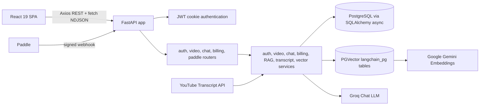

# TubeChat Technical Documentation

> Source of truth: the implementation in `client/` and `server/`. This document describes the current architecture, not planned features.

## 1. System Overview

TubeChat is a React single-page application backed by a FastAPI service. A user submits a YouTube URL, the server extracts and splits its transcript, creates Google Gemini embeddings, stores the vectors in PostgreSQL/PGVector, and streams transcript-grounded answers from Groq. Registered users can return to their saved sessions; guest users receive an automatically created account and a secure cookie but their session history is not exposed through the chat-history endpoints.

The application has two independently runnable parts:

- `client/`: React 19 + Vite frontend, styled with Tailwind CSS through `@tailwindcss/vite`.
- `server/`: FastAPI application with SQLAlchemy async persistence, LangChain RAG services, and Paddle webhook handling.

## 2. Runtime Architecture


```mermaid
flowchart LR
    Browser[React 19 SPA] -->|Axios REST + fetch NDJSON| API[FastAPI app]
    API --> Auth[JWT cookie authentication]
    API --> Routers[auth, video, chat, billing, paddle routers]
    Routers --> Services[auth, video, chat, billing, RAG, transcript, vector services]
    Services --> SQL[(PostgreSQL via SQLAlchemy async)]
    Services --> Vectors[(PGVector langchain_pg tables)]
    Transcript[YouTube Transcript API] --> Services
    Vectors --> Embeddings[Google Gemini Embeddings]
    Services --> LLM[Groq Chat LLM]
    Paddle[Paddle] -->|signed webhook| API
```

`server/app/main.py` creates the FastAPI application, configures CORS for the production frontend and local Vite origins, initializes the PGVector store during lifespan startup, and stores the prompt and LLM instances on `app.state`. The routers obtain those shared AI objects through `rag_dependency.py`.

## 3. Repository Structure

```text
YoutubeChatbot/
├── README.md
├── DOCUMENTATION.md
├── client/
│   ├── package.json
│   ├── vite.config.js
│   └── src/
│       ├── App.jsx
│       ├── main.jsx
│       ├── index.css
│       ├── components/
│       │   ├── AppHeader.jsx
│       │   ├── AppShell.jsx
│       │   ├── ChatComposer.jsx
│       │   ├── ChatMessageList.jsx
│       │   ├── ContextPanel.jsx
│       │   ├── IndexForm.jsx
│       │   ├── NavRail.jsx
│       │   └── TopBar.jsx
│       ├── contexts/AppContext.jsx
│       ├── pages/
│       │   ├── ChatPage.jsx
│       │   ├── HomePage.jsx
│       │   ├── IndexPage.jsx
│       │   ├── LoginPage.jsx
│       │   ├── PricingPage.jsx
│       │   └── RegisterPage.jsx
│       └── services/api.js
└── server/
    ├── requirements.txt
    ├── runtime.txt
    ├── alembic/
    └── app/
        ├── main.py
        ├── backfill.py
        ├── database/
        │   ├── base_model.py
        │   ├── database.py
        │   ├── crud/video_crud.py
        │   └── models/
        ├── dependencies/
        ├── routers/
        ├── schemas/
        └── services/
```

The client uses one `AppContext` module for authentication state and API-backed actions. `App.jsx` registers routes and wraps them with `AuthProvider` and `AppShell`. There is no separate `AuthContext.jsx`, `App.css`, React Router guard layer, or Axios-only streaming implementation in the current tree.

## 4. Backend Layers

### Routers

- `auth_route.py`: register, login, logout, and current-user/guest bootstrap endpoints.
- `video_route.py`: video indexing and authenticated session lookup for a video.
- `chat_route.py`: NDJSON chat streaming, recent sessions, and session retrieval.
- `billing_route.py`: authenticated plan and Paddle configuration lookup.
- `paddle_route.py`: signed Paddle webhook endpoint.

### Dependencies

- `db_dependency.py` supplies an async SQLAlchemy session.
- `auth_dependency.py` reads and validates the `access_token` cookie. Optional routes return `None` for a missing or invalid token; required routes return HTTP 401.
- `rag_dependency.py` reads the startup-created prompt and LLM from `app.state`.

### Services

- `auth_service.py`: bcrypt password hashing, HS256 JWT creation/decoding, and guest account creation.
- `video_service.py`: YouTube ID extraction, transcript indexing, per-user video limits, and session creation.
- `transcript.py`: YouTube transcript retrieval and `RecursiveCharacterTextSplitter` processing with 3,000-character chunks and 300-character overlap.
- `vector_store.py`: singleton async PGVector initialization, batched embedding writes, retry delays, MMR retriever creation, and the last 10 messages of chat history.
- `rag.py`: Gemini embedding construction, Groq LLM construction, prompt construction, and the LCEL retrieval pipeline.
- `chat_service.py`: message/video limit validation, session creation, RAG streaming, message persistence, and session queries.
- `billing_service.py`: subscription lookup and default free-subscription creation.
- `paddle_service.py`: Paddle-Signature timestamp/HMAC-SHA256 verification and subscription updates.
- `rate_limit_service.py`: in-memory 24-hour IP windows for guest video indexing and messages.
- `youtube.py`: YouTube URL parsing and 11-character ID extraction.

## 5. Data Model

```mermaid
erDiagram
    USERS ||--o{ CHAT_SESSIONS : owns
    USERS ||--o| SUBSCRIPTIONS : has
    VIDEOS ||--o{ CHAT_SESSIONS : contains
    CHAT_SESSIONS ||--o{ MESSAGES : contains
    USERS { uuid id PK; string email UK; string hashed_password; datetime created_at; datetime updated_at }
    VIDEOS { uuid id PK; string youtube_id UK; datetime indexed_at }
    CHAT_SESSIONS { uuid id PK; uuid user_id FK nullable; uuid video_id FK; string title; datetime created_at; datetime updated_at }
    MESSAGES { uuid id PK; uuid session_id FK; enum role; text content; datetime created_at }
    SUBSCRIPTIONS { uuid id PK; uuid user_id FK UK; string plan; string status; string paddle_customer_id; string paddle_subscription_id; datetime current_period_end; int videos_indexed_this_period }
```

`ChatSession.user_id` is nullable because guest sessions are created without an owning registered identity in the chat stream. PostgreSQL cascades video/session message ownership as defined by the SQLAlchemy foreign keys. Videos are globally unique by their YouTube ID, while sessions are user-specific.

## 6. Authentication, Guests, and Limits

The server signs HS256 JWTs for seven days and stores them in an `access_token` cookie with `httponly=True`, `secure=True`, `samesite="None"`, and `path="/"`. The signing secret is read from `JWT_SECRET_KEY`.

`GET /auth/me` is also the guest bootstrap endpoint. Without a valid cookie it creates a database user whose email ends in `@guest.tubechat.ai`, creates a free subscription row, sets the cookie, and returns `id`, `email`, `created_at`, and `is_guest`.

Limits enforced by the current code are:

| User type | Message limit | Video limit |
|---|---:|---:|
| Guest per chat session | 8 | 2 videos per 24 hours per IP |
| Guest IP window | 20 messages per 24 hours per IP | 2 videos per 24 hours per IP |
| Registered free | 15 messages per chat session | 2 videos with sessions |
| Registered Pro | 100 messages per chat session | 15 videos with sessions |

Guest sessions return an empty message list from session retrieval and guest users are excluded from recent-session results. Guest rate limits are process-local in-memory lists and reset when the server restarts.

## 7. Video Indexing and RAG

1. `POST /video/index` validates the URL and extracts the YouTube ID.
2. `video_service.py` checks PostgreSQL and the PGVector collection for existing records.
3. If vectors are missing, the transcript service calls Supadata using `SUPADATA_API_KEY`. If Supadata is unavailable, returns an unusable response, or the key is not configured, `YouTubeTranscriptApi.fetch()` is used as a fallback.
4. The full transcript is split into 3,000-character documents with 300-character overlap and metadata containing `youtube_id`.
5. `vector_store.py` writes documents in batches of 5, waits one second between batches, and retries provider rate-limit failures up to five times with exponential delays.
6. `GoogleGenerativeAIEmbeddings` uses `models/gemini-embedding-001`; the PGVector collection is `youtube_transcripts`.
7. A PostgreSQL `Video` row is created if needed, and a `ChatSession` titled `New Chat` is created or reused for the user.

For chat, `get_retriever(youtube_id)` uses MMR with `k=5` and a metadata filter for that video. The RAG pipeline combines retrieved text, the last 10 persisted messages, and the question in a `ChatPromptTemplate`, then calls `ChatGroq`. The model defaults to `llama-3.3-70b-versatile` and can be changed with `GROQ_MODEL`.

## 8. Chat Streaming

The frontend uses Axios for ordinary requests and native `fetch` for `POST /chat/messages/stream`. The response media type is `application/x-ndjson`. Each line is an independent JSON object:

```text
{"type":"session","session_id":"..."}
{"type":"answer","content":"token text"}
{"type":"done"}
{"type":"error","content":"Something went wrong generating the response."}
```

The session event is emitted first. The client appends answer chunks to an optimistic assistant message, navigates to the new session after completion, and removes optimistic messages when an error occurs. After the LLM stream finishes, the server commits the user and assistant messages to PostgreSQL.

## 9. API Contract

| Method | Path | Authentication | Purpose |
|---|---|---|---|
| `GET` | `/` | None | Health-style application response |
| `POST` | `/auth/register` | None | Create account; request includes `email`, `password`, `confirmPassword` |
| `POST` | `/auth/login` | None | Authenticate and set cookie |
| `POST` | `/auth/logout` | None | Delete cookie |
| `GET` | `/auth/me` | Optional | Return user or bootstrap guest |
| `POST` | `/video/index` | Optional | Index video and return `id`, `youtube_id`, `indexed_at`, `session_id` |
| `GET` | `/video/{youtube_id}/chat-sessions` | Required | List sessions for the current user and video |
| `POST` | `/chat/messages/stream` | Optional | Stream an answer for `youtube_id` or `session_id` plus `question` |
| `GET` | `/chat/recent-sessions` | Optional | Return up to 10 sessions for registered users |
| `GET` | `/chat/chat-sessions/{session_id}` | Optional | Return session metadata and visible messages |
| `GET` | `/billing/config` | Required | Return plan/status and Paddle checkout configuration |
| `POST` | `/paddle/webhook` | Paddle signature | Verify and process subscription events |

## 10. Configuration and Deployment

Backend configuration is loaded from environment variables. The important values are `DATABASE_URL`, `JWT_SECRET_KEY`, `GOOGLE_API_KEY`, `GROQ_API_KEY`, `GROQ_MODEL` (optional), `SUPADATA_API_KEY` (recommended for transcript retrieval), `PADDLE_WEBHOOK_SECRET`, `PADDLE_PRO_PRICE_ID`, `PADDLE_CLIENT_SIDE_TOKEN`, and `PADDLE_ENVIRONMENT` (defaults to `sandbox`). The client uses `VITE_API_BASE_URL`, defaulting locally to `http://localhost:8000`.

The backend runtime is Python `3.11.13` as declared by `server/runtime.txt`. Run it from `server/` with `uvicorn app.main:app --reload --host 0.0.0.0 --port 8000`. Run the Vite client from `client/` with `npm run dev`; the default development URL is `http://localhost:5173`.

For deployment, the client is a Vite build whose output is `client/dist`; the backend installs `server/requirements.txt` and starts `app.main:app`. Production CORS currently allows `https://tube-chat-web.vercel.app`, `http://localhost:5173`, and `http://127.0.0.1:5173`.

## 11. Current Boundaries

The implementation supports YouTube transcripts only. It does not currently implement PDF ingestion, website ingestion, playlists, timestamp citations, public shared sessions, a browser extension, or a mobile application. Pro limits are finite in the backend even though the pricing screen uses marketing copy such as “unlimited”; the enforced values in this document are authoritative.